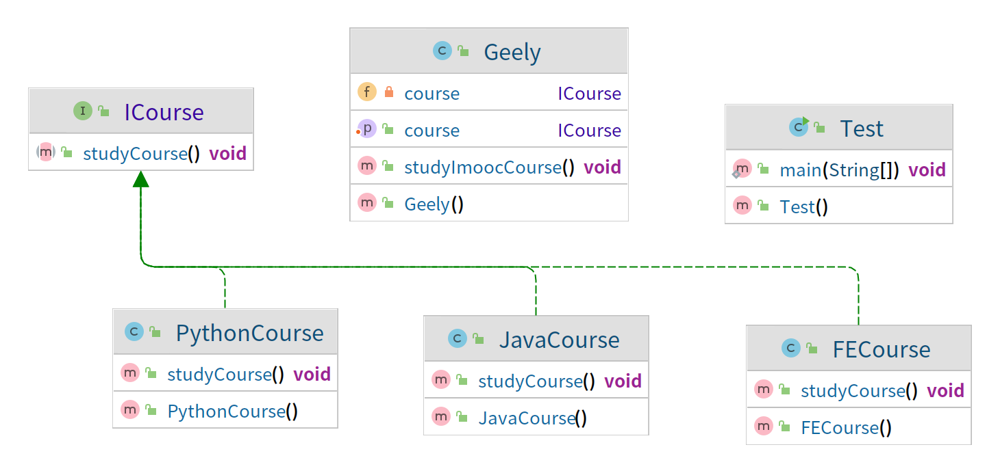

### 依赖倒置原则（面向接口编程）

- 定义：高层模块不应该依赖低层模块，二者都有应该依赖其抽象；

- 抽象不应该依赖细节；细节应该依赖抽象；

- 针对接口编程，不要针对实现编程；

- 优点：可以减少类间的耦合型、提高系统稳定性，提高代码可读性可可维护性，可降低修改程序所造成的风险；

> 案例： 
> Geely在慕课网学习，对Java课程感兴趣，对前端课程也感兴趣；假设Geely还想学习Python课程。 
> 则修改如下： 
> 
> v1：面向实现编程
> 1. Geely是个实现类，当Geely想学习新的课程，需要新增方法，经常修改，扩展型较差；
> 2. Test是应用层，直接依赖于Geely。
> 3. Test是高层模块，Geely是低层模块。根据依赖倒置原则，高层模块不应依赖于低层次模块。
> 4. Test里的实现不应该依赖于Geely的具体实现，导致每次都需要先修改Geely后才能在Test使用。
> 
> v2：直接注入
> 1. 课程接口
> 2. Java课程实现类、前端课程实现类、Python课程实现类
> 3. Geely实现一个学习方法，传入课程实现类实例
> 4. 需要学习什么课程，均由高层次模块Test实现，低层次模块Geely只是学习，不管实现
> 
> v3：构造器注入
> 1. 课程接口
> 2. Java课程实现类、前端课程实现类、Python课程实现类
> 3. Geely，课程属性，实现构造方法，传入课程实现类实例
> 4. 需要学习什么课程，均由高层次模块Test实现，低层次模块Geely只是学习，不管实现
>
> v4：set注入
> 1. 课程接口
> 2. Java课程实现类、前端课程实现类、Python课程实现类
> 3. Geely,课程属性，添加set方法，传入课程实现类实例，单例，不依赖具体构造器
> 4. 需要学习什么课程，均由高层次模块Test实现，低层次模块Geely只是学习，不管实现 

