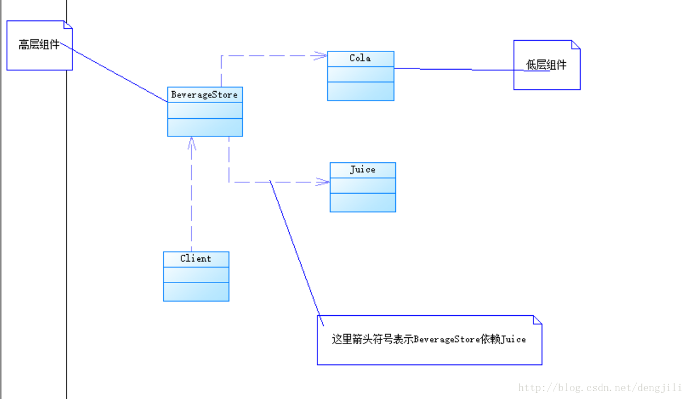
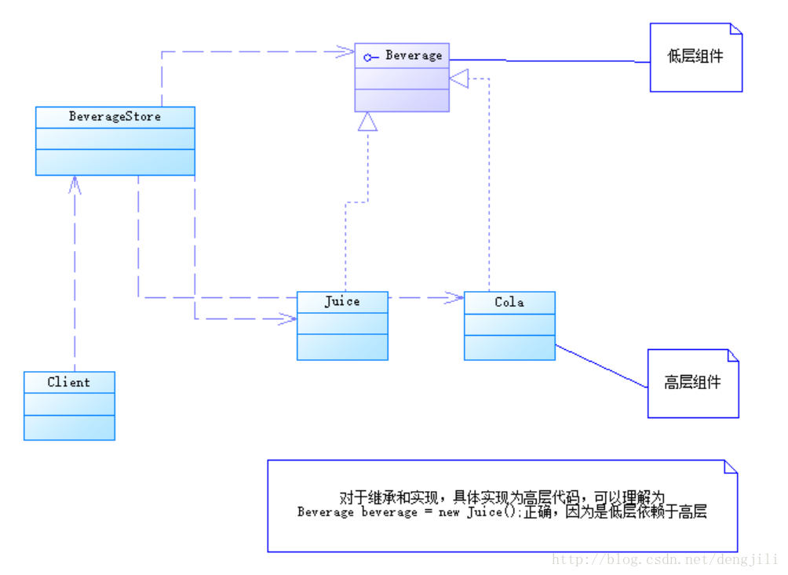
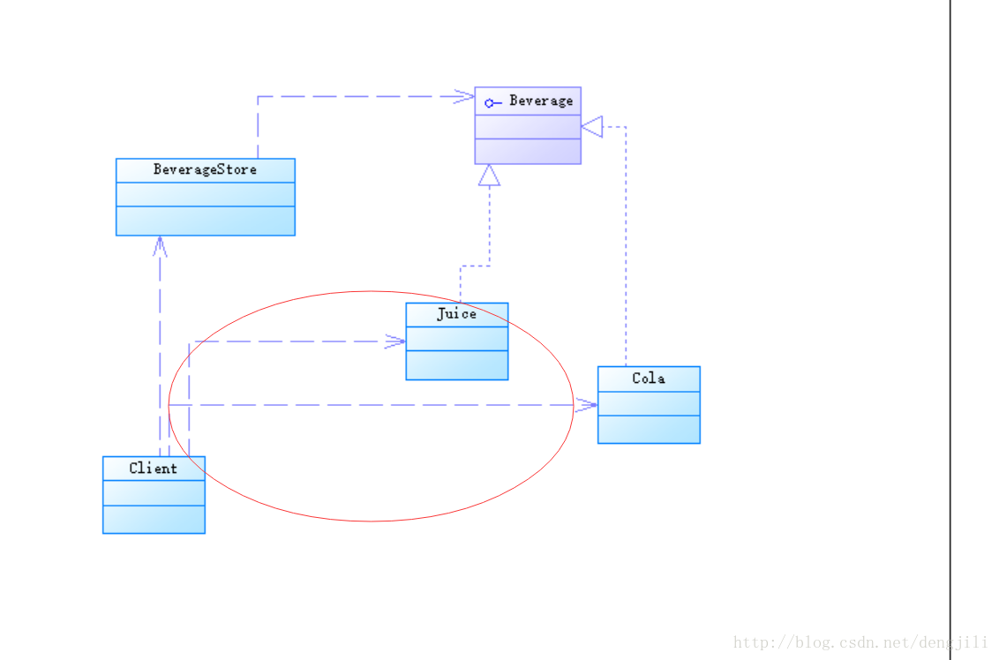
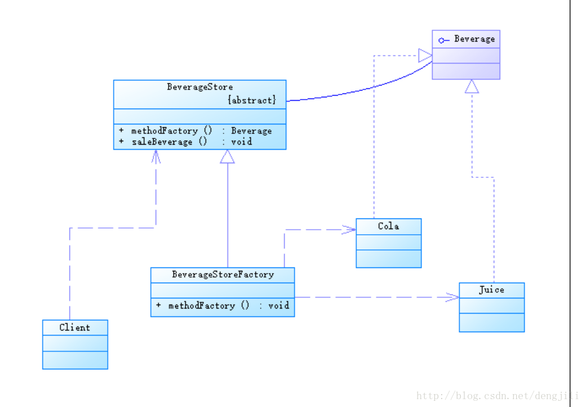
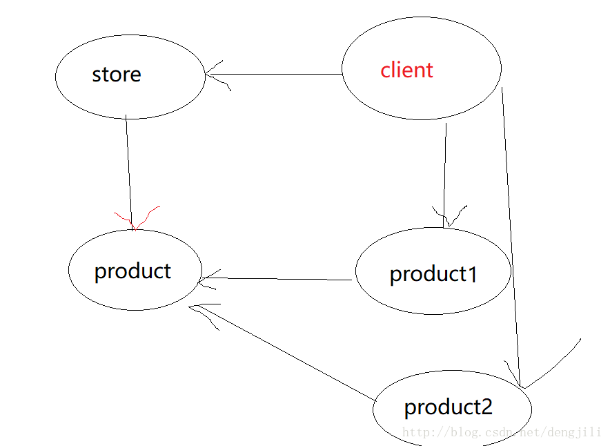
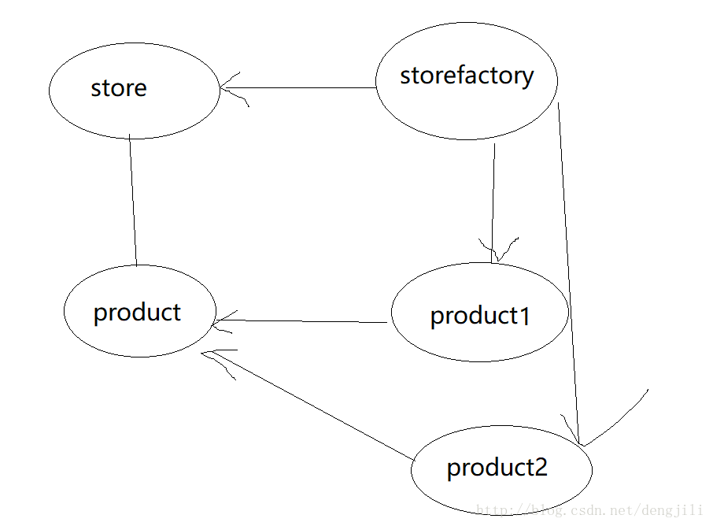
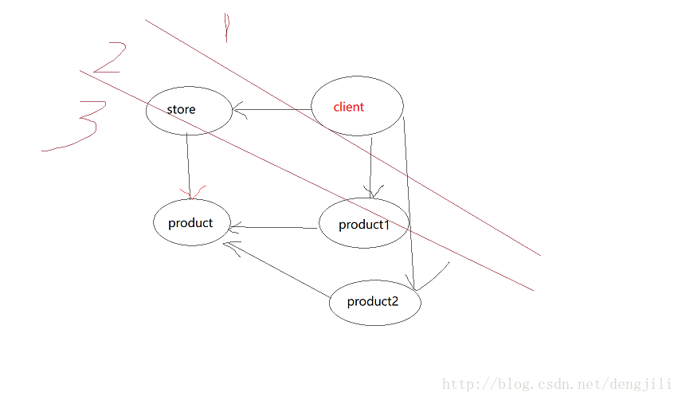
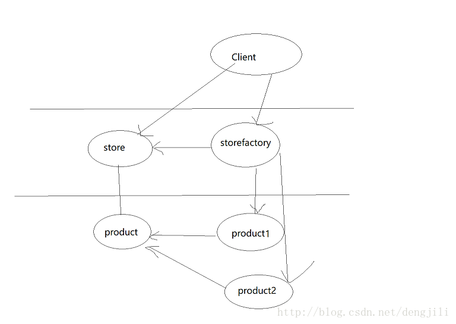

# 依赖倒置原则定义，及倒置的两种理解

## 依赖倒置原则定义

如下（可先不管）
- 高层模块不应该依赖低层模块，两者都应该依赖抽象
- 抽象不应该依赖细节
- 细节应该依赖抽象

> 情景描述：<br>
> 当前有一家饮料店，里面卖着很多饮料

### 设计如下


### 问题描述

这里箭头符号表示`BeverageStore`依赖`Juice`，及高层依赖于低层
在`BeverageStore`中，对应的是具体的饮料实现，具体代码如下
```java
package headfirst.hd.dep;

public class BeverageStore {

    //卖果汁
    public Juice saleBeverage() {
        //果汁的具体实现
        Juice juice = new Juice();
        return juice;
    }
}
```
修改设计，为饮料提供统一接口

> 备注：这是网上很多教程讲的例子，根据我自己的理解，这不是依赖倒置的体现，后来我会给出原因


核心代码变为以下代码，依赖变为不仅依赖低层组件的实现，而且还依赖低层组件的抽象，比之前还更糟糕
```java
package headfirst.hd.dep;

public class BeverageStore {

    //卖果汁
    public Beverage saleBeverage() {
        //果汁的具体实现
        Beverage beverage = new Juice();
        return beverage;
    }
}
```

对这个代码再优化一下
```java
package headfirst.hd.dep;

//这是网上最常见方式
public class BeverageStore {
    //卖果汁
    public Beverage saleBeverage(Beverage beverage) {
        //做一些其他操作
        return beverage;
    }
}
```
- 客户端Client
```java
package headfirst.hd.dep;

public class Client {
    public static void main(String[] args) {
        BeverageStore store = new BeverageStore();
        store.saleBeverage(new Juice());

    }
}
```
对应设计变化为


高层依赖低层还是存在，并且由更高层依赖了低层模块
我个人觉得这应该叫依赖转移

## 引入工厂方法模式改进以上例子
工厂模式设计图



核心代码
- `BeverageStore`
```java
package headfirst.hd.dep;

//工厂方法模式
public abstract class BeverageStore {
    //卖果汁
    public Beverage saleBeverage() {
        //直接使用自身定义的抽象方法
        Beverage beverage = createBeverage();
        //做一些其他操作
        return beverage;
    }

    /**
     * 抽象类BeverageStore抽象方法定义，Beverage createBeverage()
     * 表明createBeverage与BeverageStore为一体，关系为一根横线，
     * 两者没有实质依赖关系，因为在BeverageStore中，直接使用自身
     * 定义方法createBeverage，在类BeverageStore的其他方法中，
     * 直接使用该类型，具体实现具体类，延迟到子类
     */
    abstract Beverage createBeverage();
}
```
- `BeverageStoreFactory`
```java
package headfirst.hd.dep;

//工厂方法模式
public class BeverageStoreFactory extends BeverageStore{
    @Override
    Beverage createBeverage() {
        //可传入参数，得到更多实例，
        //或者BeverageStoreFactory2，多个工厂方法，都可以
        return new Juice();
    }
}
```

- 测试`Client`
```java
package headfirst.hd.dep;
    public class Client {
        //优秀啦，一点都没有低层模块代码
        public static void main(String[] args) {
            BeverageStore store = new BeverageStoreFactory();
            store.saleBeverage();
        }
}
```

### 理解加入模式前后的不同
- 加入前


- 加入后


* 主要区别体现在两点

  1. `store`与`product`关系
      加入工厂前，实际上还是具有依赖关系，实质上将依赖关系往更高层转移
    ```java
    package headfirst.hd.dep;
    
    //这是网上最常见方式
    public class BeverageStore {
        //卖果汁
        public Beverage saleBeverage(Beverage beverage) {
            //做一些其他操作
            return beverage;
        }
    }
    ```
    加入工厂后
    ```java
    //工厂方法模式
    public abstract class BeverageStore {
        //卖果汁
        public Beverage saleBeverage() {
            //直接使用自身定义的抽象方法
            Beverage beverage = createBeverage();
            //做一些其他操作
            return beverage;
        }
    
        /**
         * 抽象类BeverageStore抽象方法定义，Beverage createBeverage()
         * 表明createBeverage与BeverageStore为一体，关系为一根横线，
         * 两者没有实质依赖关系，因为在BeverageStore中，直接使用自身
         * 定义方法createBeverage，在类BeverageStore的其他方法中，
         * 直接使用该类型，具体实现具体类，延迟到子类
         */
        abstract Beverage createBeverage();
    }
    ```
    所有加入前还是具有依赖关系，所以是箭头，加入工厂模式之后，为接口定义，为一体，所以属于直线

    2. `storefactory`取代了`Client`位置
       - 加入前层级关系
       
       - 加入后层级关系
       

## 倒置的两种理解
### 第一种，从设计上理解


如果所示，正常都是高层调用低层，简单推理一下

`product1`（具体的实现）依赖于`product`（抽象）
由于引入工厂模式后，`store`与`product`为同一关系（同时存在）
推理出，`product1`（具体的实现）依赖于`store`
因此，形成了依赖倒置的现象

### 第二种，从思想上理解
- 没有引入工厂方法模式之前，我们需要一杯果汁（`Juice`），我们的思路时候这样的

    先有一个饮料店（`BeverageStore`），然后才会有果汁（`Juice`），简单的说就是先有饮料店，最后决定卖什么饮料

- 引入工厂方法模式之前，我们需要一杯果汁（`Juice`），我们的思路时候这样的

     这里写图片描述

先定义饮料接口，后实现具体的饮料店，这些我们可以理解为，我们先选择什么要的饮料，最后决定开什么样的饮料店

因此，形成了依赖倒置的现象