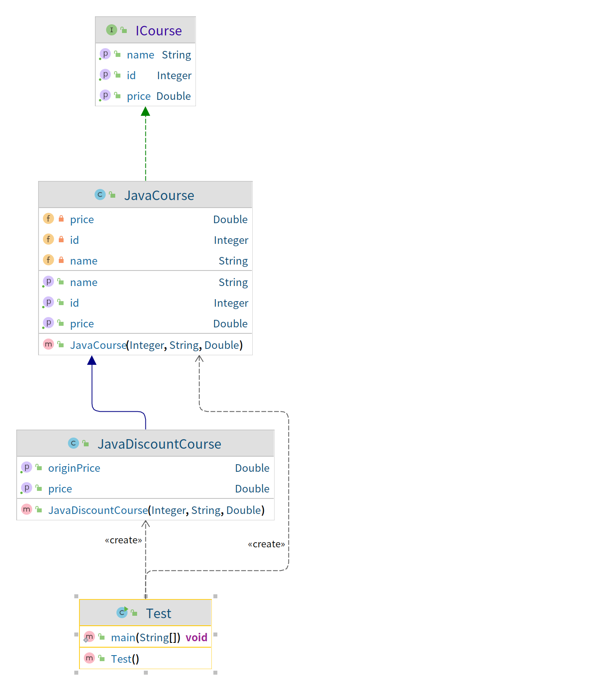

### 开闭原则

- 定义：一个软件实体如类、模块和函数应该对扩展开放，对修改关闭；
  
- 用抽象构建框架，用实现扩展细节
  
- 优点：提高软件的可复用性及可维护性

> 案例： 
> 1. 课程接口，定义获取课程信息的方法
> 2. Java课程实现类，实现课程接口
> 3. 背景：因做活动，增加功能，获取折扣价
> 4. v1：在课程接口中增加获取折扣价的方法，这样导致所有实现类都需要实现该方法
>    * 接口不应该经常变化，它应该是稳定的。
> 5. v2：在Java课程实现类中修改获取价格的方法。但是这样获取不到原价。增加获取折扣价的方法，如果课程实现类很多，那工程量会很大
> 6. v3：新增一个Java折扣类，继承实现了课程接口的Java课程实现类，在该子类里新增功能（通过重写父类方法或者新增方法进行扩展）。这样避免了因修改Java课程实现类对以往业务的影响。

